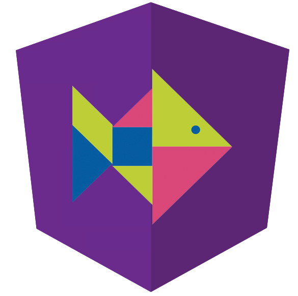

# NiceFish（美人鱼）

NiceFish是一个系列教学项目，都是Angular这个技术栈。

- NiceFish：美人鱼，这是一个微型Blog系统，前端基于Angular 4.x + PrimeNG。<http://git.oschina.net/mumu-osc/NiceFish/>

- NiceFish-Admin：这是系统管理界面，基于Angular 4.x+PrimeNG，<http://git.oschina.net/mumu-osc/NiceFish-Admin>

- NiceFish-ionic：这是一个移动端的demo，基于ionic。<http://git.oschina.net/mumu-osc/nicefish-ionic>

- NiceFish-SpringMybatis：这是Java版后台服务，<http://git.oschina.net/mumu-osc/NiceFish-SpringMybatis>

- NiceBlogElectron：<https://github.com/CN-Tower/NiceBlogElectron> ,这是一个基于Electron的桌面端项目，把NiceFish用Electron打包成了一个桌面端运行的程序。这是由ZTE中兴通讯的前端道友提供的，如果您正在研究如何利用Electron开发桌面端应用，请参考这个项目。

## 对应的视频教程

此项目对应的视频教程（超清），包括所有PPT，请点这里：<http://damoqiongqiu.github.io/videos/index.html>

有一些人抱怨说视频没有从头手敲代码，跟不上节奏，如果你是从0开始学习Angular，还是看收费版的视频吧，讲得更细致一些（我自己觉得很啰嗦），内容提纲也在我的主页上，你自己找着看。

## 用法

用git克隆本项目，从命令行进入进入项目根目录，依次执行以下命令：

```
npm i -g cnpm --registry=https://registry.npm.taobao.org
cnpm i -g @angular/cli
cnpm install
ng serve
```

如果之前装过angular-cli需要先卸载：npm uninstall -g angular-cli 如果之前装过@angular/cli需要先卸载：npm uninstall -g @angular/cli 如果你之前已经尝试安装过node模块，请把NiceFish根目录下的node_moduels目录删掉 然后依次执行以下命令：

```
npm cache clean
npm prune
npm i -g cnpm
cnpm i -g @angular/cli
cnpm install
ng serve
```

打开你的浏览器，访问<http://localhost:4200/>

如果你想让加载的包更小，请使用以下方式启动angular-cli内置的轻量级http server

```
ng serve --prod
```

如果你需要把项目发布到其它类型的Server上，例如Tomcat，需要对Server进行一些简单的配置才能支持HTML5下的PushState路由模式，我在这篇文章里面有详细的介绍<https://my.oschina.net/mumu/blog/830696>

【注意】如果你发现ng serve起不来，或者起来有报错，请把NiceFish根目录下的node_modules目录删掉，然后重新执行cnpm install，全局的@angular/cli也需要删掉重装。

## 如何更新NiceFish的代码

打开命令行，进入NiceFish根目录，依次执行以下命令：

```
git pull
cnpm update
ng serve
```

噢对，如果你pull代码之后发现起不来了，请把你项目下的node_modules全部删掉，然后重新cnpm update。这里确实有点坑，但是我也不知道为什么，目测是npm包的版本问题。

## AOT&TreeShaking

开发状态打出来的bundle体积比较大，在发布到生产环境之前需要进行prod和AOT，用法如下：

打开命令行，进入NiceFish根目录，执行以下命令：

```
ng build --prod
```

加上--prod参数之后，angular-cli会自动启用TreeShaking（摇树）特性，简而言之，就是把用不到的包全部剔除掉，就像从树上把枯叶子摇下来一样，很形象吧？

angular-cli会在项目根目录下生成一个dist目录，里面就是编译、压缩好的文件了。仔细观察你会发现，这些文件的体积已经被大幅度压缩，加上gzip之后有一些文件只剩下1/4左右的大小。

【请注意】最新版本的@angular/cli已经内置了对AOT和TreeShaking的支持，只要像上面这样在build的时候加上--prod参数就可以了，不需要再做任何其它任何配置工作，中文网站上的那一篇指南过时了。
